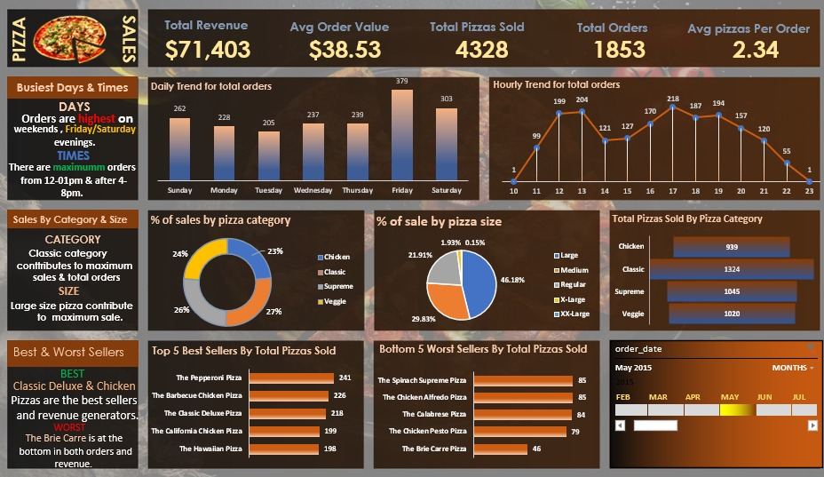

#  Pizza Sales Dashboard – Data Analysis Project  

## 🎯 Project Objective  
The objective of this project is to analyze pizza sales data to uncover key business insights that can help improve sales performance, product strategy, and operational efficiency.  

This dashboard aims to:  
- 🔍 Identify top-performing pizza categories and sizes that generate the highest revenue.  
- 🕒 Determine the busiest days and peak ordering hours to optimize staffing and inventory management.  
- 📈 Highlight best and worst-selling pizzas to guide marketing and menu decisions.  
- 💡 Analyze customer purchasing trends through total sales, order volume, and average order value.  
- 📊 Provide an interactive and data-driven visualization for management to make informed, strategic business decisions.

## 📘 Project Overview  

This project analyzes pizza sales data using **SQL** and **Excel** to uncover insights on revenue, top-selling pizzas, and customer trends.  
It features an interactive dashboard that highlights **sales performance**, **peak order times**, and **best/worst-selling products**, helping businesses make **data-driven decisions** for improved efficiency and growth.  

## 📊 Dashboard Preview  

## 🛠️ Tools & Technologies  

| Tool / Technology | Purpose |
|--------------------|----------|
| 🧮 **Microsoft Excel** | Data visualization, dashboard creation, and analysis using charts, pivot tables, and slicers |
| 🗃️ **SQL (MS SQL Server)** | Data extraction, cleaning, aggregation, and trend analysis |

## 🔎 Key Insights  
- Total Revenue: **$71,403**  
- Average Order Value: **$38.53**  
- Total Pizzas Sold: **4,328**  
- Highest Orders: **Friday & Saturday evenings (12–1 PM, 4–8 PM)**  
- Best Sellers: **Classic Deluxe** and **Chicken Pizzas**  
- Lowest Seller: **Brie Carre Pizza**
## 📁 Project Structure  

📂 Pizza_Sales_Dashboard
├── 📄 dataset.csv # Raw pizza sales data
├── 🗃️ pizza_sales_queries.sql # SQL queries for data analysis
├── 📊 Pizza_Sales_Dashboard.xlsx # Excel dashboard and visualizations
├── 🖼️ Pizza_Sales_Dashboard.jpg # Dashboard preview image

